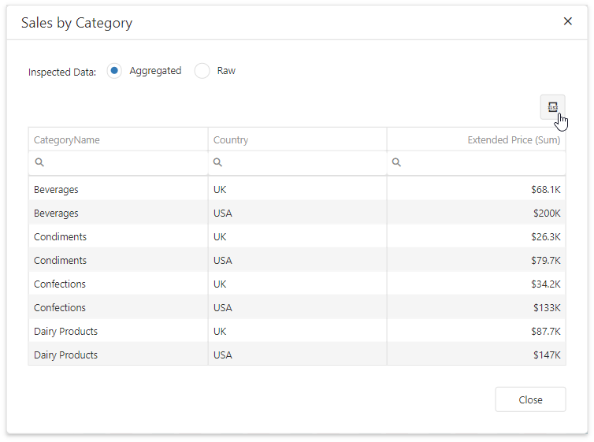

*Files to look at*:
* [WebForm1.aspx](./CS/WebForm1.aspx)
* [beforeRender.js](./CS/Scripts/beforeRender.js)

# ASPxDashboard - How to Enable Exporting in Data Inspector

This example demonstrates how to enable export to Excel for [Data Inspector](https://docs.devexpress.com/Dashboard/401194/common-features/underlying-and-displayed-data/data-inspector) in ASP.NET Web Forms. 

The client-side export requires the [JSZip](https://stuk.github.io/jszip/) third-party library. Install and reference it in your application. Refer to the [DevExtreme Client-Side Exporting](https://js.devexpress.com/Documentation/Guide/Widgets/DataGrid/Client-Side_Exporting/) topic for details.

Follow the steps below to do this: 

1. Subscribe on the [BeforeRender](https://docs.devexpress.com/Dashboard/js-ASPxClientDashboard#js_aspxclientdashboard_beforerender) event. 
2. Unregister [DataInspectorExtension](https://docs.devexpress.com/Dashboard/js-DevExpress.Dashboard.DataInspectorExtension).
3. Register a new instance of the DataInspectorExtension with custom settings. Use the [onGridInitialized](https://docs.devexpress.com/Dashboard/js-DevExpress.Dashboard.DataInspectorExtensionOptions#js_devexpress_dashboard_datainspectorextensionoptions_ongridinitialized) property to enable export for the Grid widget before its content is loaded.
4. Install and reference the [JSZip](https://stuk.github.io/jszip/) library.

API used in the example:

* The [BeforeRender](https://docs.devexpress.com/Dashboard/js-ASPxClientDashboard#js_aspxclientdashboard_beforerender) event.
* The [DataInspectorExtension](https://docs.devexpress.com/Dashboard/js-DevExpress.Dashboard.DataInspectorExtension) class.
* The [DataInspectorExtensionOptions.onGridInitialized](https://docs.devexpress.com/Dashboard/js-DevExpress.Dashboard.DataInspectorExtensionOptions#js_devexpress_dashboard_datainspectorextensionoptions_ongridinitialized) property.
* The [DashboardControlOptions.extensions](https://docs.devexpress.com/Dashboard/js-DevExpress.Dashboard.DataInspectorExtensionOptions) property.

